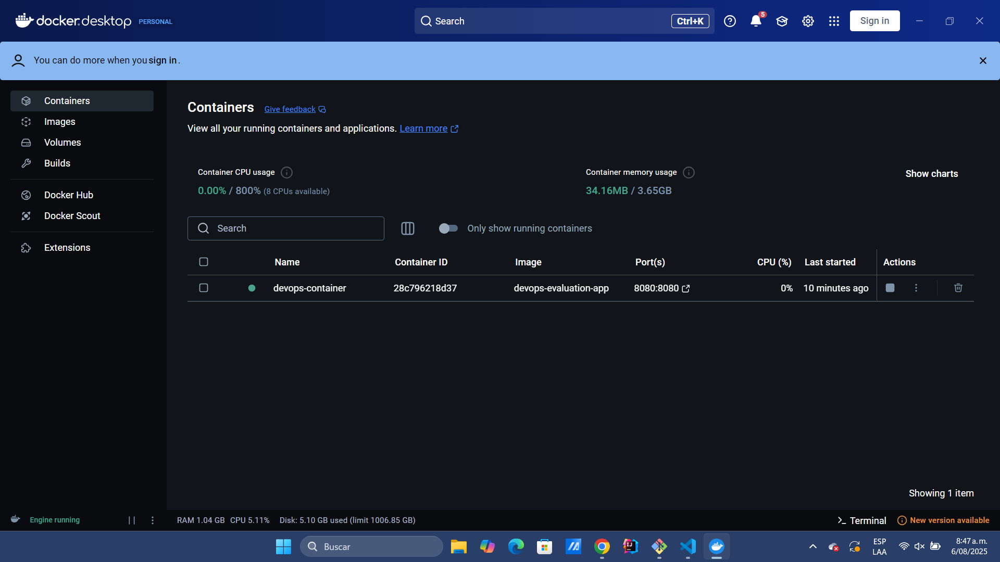
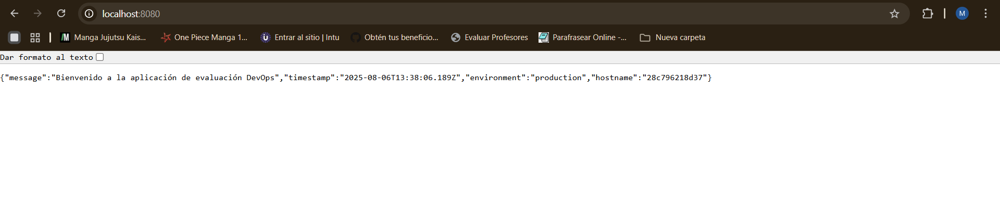
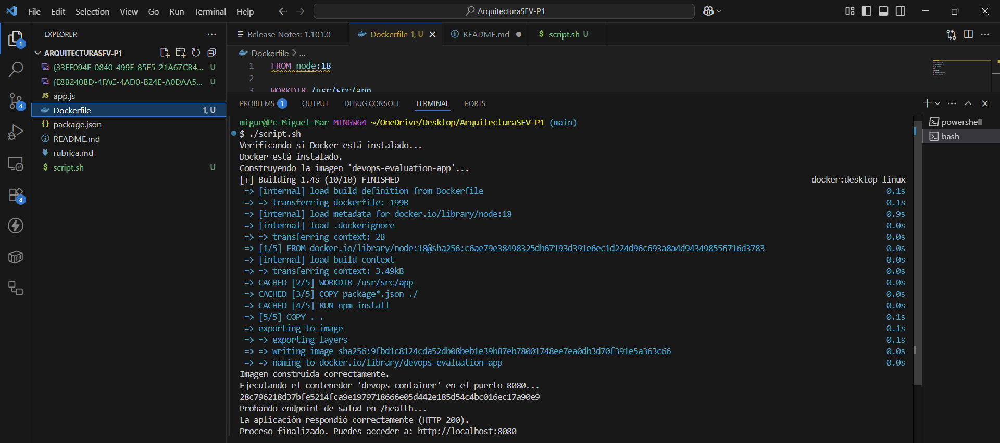

# ArquitecturaSFV-P1

# Evaluación Práctica - Ingeniería de Software V

## Información del Estudiante
- **Nombre:** Miguel Angel Martínez Vidal  
- **Código:** A00396327  
- **Fecha:** 06/08/2025

---

## Resumen de la Solución

La solución propuesta toma una aplicación Node.js y la conteneriza utilizando Docker. Se crea un `Dockerfile` desde cero y se acompaña con un script de automatización en Bash (`script.sh`) que construye la imagen, ejecuta el contenedor, verifica que el servicio esté activo y funcional, y muestra el estado final. El objetivo principal es demostrar conocimientos prácticos de contenerización, scripting y fundamentos de DevOps.

---

## Dockerfile

El `Dockerfile` fue construido con las siguientes decisiones técnicas:

- **Imagen base:** Se usó `node:18` por ser una versión estable y ampliamente utilizada.
- **Directorio de trabajo:** Se definió `/usr/src/app` como el lugar donde se alojará la app dentro del contenedor.
- **Instalación de dependencias:** Se copian primero los archivos `package*.json` y se ejecuta `npm install` para optimizar el uso de la caché.
- **Copia del código:** Posteriormente se copian todos los archivos restantes.
- **Exposición de puerto:** Se expone el puerto `8080` para que la app sea accesible desde fuera del contenedor.
- **Variable de entorno:** Se establece `NODE_ENV=production` como valor por defecto.
- **Comando de inicio:** Se utiliza `CMD ["npm", "start"]` para iniciar la aplicación al ejecutar el contenedor.

---

## Script de Automatización

El script `script.sh` automatiza todo el proceso de despliegue. Incluye los siguientes pasos:

1. **Verificación de Docker:** Comprueba si Docker está instalado y disponible en el sistema.
2. **Construcción de imagen:** Usa `docker build` para crear una imagen llamada `devops-evaluation-app`.
3. **Limpieza previa:** Si ya existe un contenedor con el mismo nombre (`devops-container`), lo elimina para evitar conflictos.
4. **Ejecución del contenedor:** Crea y ejecuta un nuevo contenedor mapeando el puerto 8080 y seteando la variable de entorno `PORT=8080`.
5. **Prueba de salud:** Verifica que el endpoint `/health` responda correctamente (HTTP 200) mediante `curl`.
6. **Resumen final:** Muestra si todo salió bien y proporciona la URL local para acceder.

---

## Principios DevOps Aplicados

1. **Automatización del despliegue:** Mediante el script se eliminan tareas manuales, reduciendo errores humanos.
2. **Entornos reproducibles:** Uso de Docker para garantizar que el entorno de ejecución sea siempre el mismo.
3. **Verificación continua:** El script incluye pruebas de salud básicas que confirman que el servicio está activo.

---

## Captura de Pantalla

## Mejoras Futuras

1. **Incluir soporte para .env:** Para manejar variables de entorno de manera más flexible y segura.

2. **Validar más endpoints:** Agregar más pruebas dentro del script para asegurar otras rutas críticas.

3. **Agregar docker-compose:** Facilitar la orquestación si en el futuro se agregan más servicios (como base de datos).

## Instrucciones para Ejecutar

1. Clonar este repositorio en su máquina local:

2. Asegurarse de tener Docker instalado

3. Abrir Docker

4. Darle permisos de ejecución al script (solo la primera vez):
chmod +x script.sh

5. Ejecutar el script en bash:

./script.sh

6. Una vez que el script termine, abra su navegador y acceda a:
http://localhost:8080/health

Deberías ver una respuesta como ok o un código HTTP 200, lo que indica que la aplicación está corriendo correctamente dentro del contenedor.

Y para ver la respuesta de la aplicación, vaya a:

http://localhost:8080/

